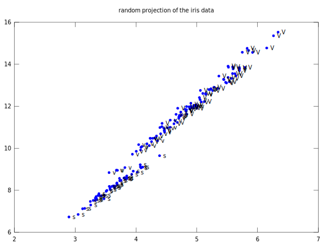
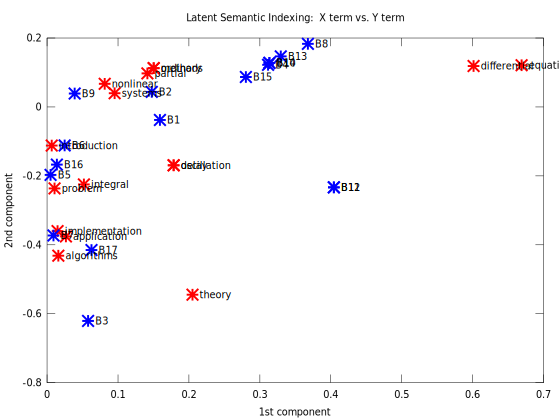
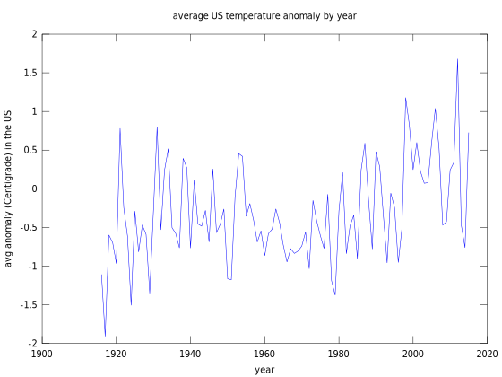

CS170A -- HW#1 -- assignment and solution form -- Matlab
========================================================

Your name: \_\_\_\_\_\_\_\_\_\_\_\_\_\_\_\_\_\_\_\_\_\_

Your UID: \_\_\_\_\_\_\_\_\_

Please upload only this notebook to CCLE by the deadline.

Policy for late submission of solutions: We will use Paul Eggert's Late
Policy: :math:`N` days late :math:`\Leftrightarrow` :math:`2^N` points
deducted} The number of days late is :math:`N=0` for the first 24 hrs,
:math:`N=1` for the next 24 hrs, etc., and if you submit an assignment
:math:`H` hours late, :math:`2^{\lfloor H/24\rfloor}` points are
deducted.

NOTE: In this assignment we provide pseudocode to get you started.
------------------------------------------------------------------

In later assignments we will not do this.

Problem 1: SVD k-th order approximations (30 points)
====================================================

If :math:`A` is a matrix that has SVD :math:`A = U\,S\,V'`, the rank-k
approximation of :math:`A`\  keeping only the first :math:`k` columns of
the SVD.

Specifically, given a :math:`n \times p` matrix :math:`A` with SVD
:math:`A = U\,S\,V'`, then if :math:`k \leq n` and :math:`k \leq p`, the
rank-\ :math:`k` approximation of :math:`A` is

.. math::

   A^{(k)} ~~=~~ U ~ S^{(k)} ~ V'

where :math:`S^{(k)}` is the result of setting all diagonal elements to
zero after the first :math:`k` entries :math:`(1 \leq k \leq p)`. If
:math:`U^{(k)}` and :math:`V^{(k)}` are like :math:`U` and :math:`V` but
with all columns zero after the first :math:`k`, then

.. math::

   A^{(k)} ~~=~~ U ~ S^{(k)} ~ V' ~~=~~ U^{(k)} ~ S^{(k)} ~ V^{(k)'} .

In class, we saw a demo of the attached Matlab script imagesvdgui.m ---
and the effectiveness of this approximation in retaining information
about an image.

The goal of this problem is to implement this approximation for
black-and-white (grayscale) images.

.. code:: python

    load mandrill
    Mandrill = ind2rgb(X, map);
    
    A = mean( Mandrill, 3 );  # grayscale image -- size 480 x 500.
    size(A)
    
    imwrite(A, 'GrayMandrill.bmp')  % Write the Mandrill to a bitmap image file
    
    % The matrix A now contains the Mandrill image (in grayscale)

.. parsed-literal::

    ans =
    
       480   500
    
    warning: your version of GraphicsMagick limits images to 8 bits per pixel
    warning: called from
        imformats>default_formats at line 256 column 11
        imformats at line 79 column 3
        imwrite at line 99 column 7

Display the bitmap image file using an HTML img tag:

1.(a): Plot Singular Values of the Rank-\ :math:`k` Approximation of an Image
~~~~~~~~~~~~~~~~~~~~~~~~~~~~~~~~~~~~~~~~~~~~~~~~~~~~~~~~~~~~~~~~~~~~~~~~~~~~~

As in HW0, construct a grayscale version of the Mandrill image, and take
one of the 3 color planes as a 500x480 matrix. This is our \`black and
white' image :math:`A`. You are to analyze the rank-k approximation of
the image.

Compute the SVD of :math:`A`, and plot the singular values
:math:`\sigma_1`, :math:`\sigma_2`, ...

.. code:: python

    [U S V] = svd(A);       % U, S, V are now the SVD of A
    
    norm( A - U * S * V' )  %  A should match the product of U, S, V'

.. parsed-literal::

    ans =    1.8353e-12

1.(b): Optimal Rank-\ :math:`k` Approximation of an Image
~~~~~~~~~~~~~~~~~~~~~~~~~~~~~~~~~~~~~~~~~~~~~~~~~~~~~~~~~

Find the value of :math:`k` that minimizes
:math:`\mid\mid{A \; - \; A^{(k)}}\mid\mid^2_{F} ~+~ k`.

.. code:: python

    [n p] = size(A)
    maximum_possible_k = min(n,p)
    
    for k=1:maximum_possible_k
       do_something = 0; % ................
    end

.. parsed-literal::

    n =  480
    p =  500
    maximum_possible_k =  480

1.(c): The Rank-\ :math:`k` Approximation is a Good Approximation
~~~~~~~~~~~~~~~~~~~~~~~~~~~~~~~~~~~~~~~~~~~~~~~~~~~~~~~~~~~~~~~~~

In the chapter on the SVD, the course reader presents a derivation for
:math:`A \, - \, A^{(k)}`:

.. math::

   \begin{eqnarray*}
   A \; - \; A^{(k)}
    & = &
   U \; S \; V' ~ - ~ U^{(k)} ~ S^{(k)} ~ V^{(k)'}  \\
    & = &
   U \; S \; V' ~ - ~ U \; S^{(k)} \; V' \\
    & = &
   U \; (S ~ - ~ S^{(k)}) \; V ' \\
   \end{eqnarray*}

Prove the following:

.. math::  \mid\mid{A \; - \; A^{(k)}}\mid\mid^2_{F} ~=~ \sum_{i>k} \sigma_i^2 . 

Proof (Enter your Proof here)
^^^^^^^^^^^^^^^^^^^^^^^^^^^^^

Because :math:`A \; - \; A^{(k)} ~ = ~ U \; (S ~ - ~ S^{(k)}) \; V '`,
..............

As a result, :math:`\mid\mid{A \; - \; A^{(k)}}\mid\mid^2_{F} ~ = ~ ...`

Therefore

.. math::  \mid\mid{A \; - \; A^{(k)}}\mid\mid^2_{F} ~=~ \sum_{i>k} \sigma_i^2 . 

Problem 2: Baseball Visualization (40 points)
=============================================

For this dataset you are given a matrix of statistics for Baseball
players. You are to perform two kinds of analysis on this matrix.

Read in the Baseball Statistics
~~~~~~~~~~~~~~~~~~~~~~~~~~~~~~~

Statistics of top players after the last regular season game, obtained
from MLB.com, October 2016.

.. code:: python

    %%% Stats = csvread('Baseball_Players_Stats_2016.csv', 1, 0);  # skip the header (= row 0)
    %%% Names = csvread('Baseball_Players_Names_2016.csv', 1, 0);
    
    Baseball_Players_2016   %% execute Baseball_Players_2016.m  to load in the data needed here

.. parsed-literal::

     added to session magics.
    

.. code:: python

    StatNames{1:3}
    
    size(StatNames)
    
    StatNames{:}

.. parsed-literal::

    ans = Rank
    ans = G
    ans = AB
    ans =
    
        1   17
    
    ans = Rank
    ans = G
    ans = AB
    ans = R
    ans = H
    ans = 2B
    ans = 3B
    ans = HR
    ans = RBI
    ans = BB
    ans = SO
    ans = SB
    ans = CS
    ans = AVG
    ans = OBP
    ans = SLG
    ans = OPS

.. code:: python

    size(Stats)
    Stats(1:3, :)

.. parsed-literal::

    ans =
    
       146    17
    
    ans =
    
     Columns 1 through 6:
    
         1.00000   146.00000   552.00000   104.00000   192.00000    32.00000
         2.00000   142.00000   531.00000    88.00000   184.00000    47.00000
         3.00000   161.00000   640.00000   108.00000   216.00000    42.00000
    
     Columns 7 through 12:
    
         8.00000    11.00000    66.00000    66.00000    80.00000    11.00000
         5.00000    25.00000   104.00000    35.00000    57.00000     5.00000
         5.00000    24.00000    96.00000    60.00000    70.00000    30.00000
    
     Columns 13 through 17:
    
         7.00000     0.34800     0.41600     0.49500     0.91100
         3.00000     0.34700     0.39000     0.59500     0.98500
        10.00000     0.33800     0.39600     0.53100     0.92800
    

.. code:: python

    size(PlayerNames)
    PlayerNames{1:3}

.. parsed-literal::

    ans =
    
       146     1
    
    ans =   LeMahieu D
    ans =   Murphy D
    ans =   Altuve J

Compute a "scaled" version of the Stats matrix
~~~~~~~~~~~~~~~~~~~~~~~~~~~~~~~~~~~~~~~~~~~~~~

We scale each column of values :math:`{\bf x}` in Stats to be
:math:`{\bf z} = ({\bf x}-\mu)/\sigma` in ScaledStats, where :math:`\mu`
is the mean of the :math:`{\bf x}` values, and :math:`\sigma` is their
standard deviation.

In Octave/Matlab, the function mean() computes column means, and std()
computes standard deviations. The function zscore() computes both, and
uses them to "scale" each column in this way.

This scaling is also called **normalization** and **standardization**.
The **z-scores** :math:`{\bf z} = ({\bf x}-\mu)/\sigma` are also called
the standardized or normalized values for :math:`{\bf x}`.

.. code:: python

    ScaledStats  =  zscore(Stats);   %  z  =  (x-mu)/sigma
    
    mean(ScaledStats)  %  the means of each column after normalization should be 0
    std(ScaledStats)   %  the standard deviations of each column after normalization should be 1

.. parsed-literal::

    ans =
    
     Columns 1 through 6:
    
      -3.1938e-17   5.0797e-16  -1.1140e-15  -1.6805e-16   2.6159e-16   2.2509e-16
    
     Columns 7 through 12:
    
      -4.5626e-17  -4.6766e-17   2.3573e-16  -1.5632e-16  -1.3079e-16  -3.5740e-17
    
     Columns 13 through 17:
    
      -2.4714e-17   4.5930e-15   6.1853e-15  -1.4676e-15   7.8856e-15
    
    ans =
    
     Columns 1 through 8:
    
       1.00000   1.00000   1.00000   1.00000   1.00000   1.00000   1.00000   1.00000
    
     Columns 9 through 16:
    
       1.00000   1.00000   1.00000   1.00000   1.00000   1.00000   1.00000   1.00000
    
     Column 17:
    
       1.00000
    

2 (a): Random Projections
~~~~~~~~~~~~~~~~~~~~~~~~~

A fundamental problem in data science is that it is impossible to
visualize a dataset that has many features. Given an :math:`n \times p`
dataset (matrix) :math:`A` in which the number of features :math:`p` is
large, there is no obvious way to plot the data.

*Dimensionality reduction* algorithms have been developed that attempt
to find datasets that have lower values of :math:`p` but approximate
:math:`A` in some way. Although there are sophisticated algorithms, a
competitive approach is to compute a ***random projection*** of
:math:`A` into a few dimensions. When the projection is into 2 or 3
dimensions, the result can be visualized.

A ***random :math:`k`-D projection*** of a :math:`n \times p` dataset
(matrix) :math:`A` is the result :math:`(A \, P)` of multiplying
:math:`A` on the right by a :math:`p \times k` matrix :math:`P` of
random values.

The result is a :math:`n \times k` matrix, assigning each row in
:math:`A` a new pair of values :math:`(x,y)`, and these can be
interpreted as positions in a 2D plot.

.. code:: python

    % plotting 2D values
    Iris = csvread('iris.csv', 1,0);  % skip over the header line
    A = Iris(:, 1:4);  % just the measurement columns
    [n p] = size(A);
    P = rand(p,2);
    disp('random projection weights:')
    disp(P)
    XY = A * P;
    plot(XY(:,1), XY(:,2), 'b.')
    title('random projection of the iris data')
    species = {'  s', '  v', '  V'}
    text(XY(:,1), XY(:,2), species(Iris(:,5)), 'FontSize', 10 )

.. parsed-literal::

    random projection weights:
       0.32171   0.84754
       0.48925   0.80849
       0.13376   0.64446
       0.50268   0.73222
    species = 
    {
      [1,1] =   s
      [1,2] =   v
      [1,3] =   V
    }

***Problem:*** write a function random\_projection(A,k) that, given an
input matrix :math:`A` of size :math:`n \times p` and an integer
:math:`k>0`, produces a random :math:`k`-D projection.

Please use uniform random values in the matrix :math:`P`.

Then: plot the result of 3 random 2D projections of the data.

In each plot, identify the ***greatest outlier*** -- the player with
:math:`(x,y)` values that have the largest total :math:`x+y`. Print the
row in the dataset whose projection is this outlier.

.. code:: python

    random_projection = @(A,k) 0 % fill in using e.g.:   ... rand(size(A,1),k) ...
    
    for i = 1:3
       XY = random_projection( ScaledStats, 2 )
    
       % plot( something_involving_XY )
       %   % text( something_involving_XY, PlayerNames, 'FontSize', 10 )
       %   text( something_involving_XY, PlayerRanks, 'FontSize', 10 )
       XplusY = sum(XY,1)
       %   greatest_outlier = something_involving_XplusY % ... (XplusY == max(XplusY)) ...
    end

.. parsed-literal::

    random_projection =
    
    @(A, k) 0
    
    XY = 0
    XplusY = 0
    XY = 0
    XplusY = 0
    XY = 0
    XplusY = 0

2 (b): Latent Semantic Analysis
~~~~~~~~~~~~~~~~~~~~~~~~~~~~~~~

The course reader describes **Latent Semantic Indexing** for a matrix of
values measuring association between X terms vs. Y terms.

The classic example is a "term/document matrix" for Keywords vs. Books,
shown below. The code shown produces an LSI plot for the data.

**Your job is to produce an analogous LSI plot for the table of Baseball
players.**

Components are computed as in: Berry, M. W., Dumais, S. T., and O'Brien,
G. W. (1995). "Using linear algebra for intelligent information
retrieval." SIAM Review, 37(4), 1995, 573-595.

Some LSI references: lsi.research.telcordia.com/lsi/LSIpapers.html

.. code:: python

    % X:  Keywords
    
    nX = 16;
    Xtext = {
            'algorithms',
            'application',
            'delay',
            'differential',
            'equations',
            'implementation',
            'integral',
            'introduction',
            'methods',
            'nonlinear',
            'ordinary',
            'oscillation',
            'partial',
            'problem',
            'systems',
            'theory'
            };
    
    % Y:  Books
    
    nY = 17;
    
    % Book: 1  2  3  4  5  6  7  8  9 10 11 12 13 14 15 16 17   # Keyword:
    %--------------------------------------------------------------------------
    coOccurrence =  [
            0  0  1  0  1  0  1  0  0  0  0  0  0  0  0  0  0;  % algorithms
            0  0  1  0  0  0  0  0  0  0  0  0  0  0  0  0  1;  % application
            0  0  0  0  0  0  0  0  0  0  1  1  0  0  0  0  0;  % delay
            0  0  0  1  0  0  0  1  0  1  1  1  1  1  1  0  0;  % differential
            1  1  0  1  0  0  0  1  0  1  1  1  1  1  1  0  0;  % equations
            0  0  1  0  0  0  1  0  0  0  0  0  0  0  0  0  0;  % implementation
            1  0  0  0  0  0  0  0  0  0  0  0  0  0  0  1  1;  % integral
            0  0  0  0  1  1  0  0  0  0  0  0  0  0  0  0  0;  % introduction
            0  0  0  0  0  0  0  1  0  0  0  0  0  1  0  0  0;  % methods
            0  0  0  0  0  0  0  0  1  0  0  0  1  0  0  0  0;  % nonlinear
            0  0  0  0  0  0  0  1  0  1  0  0  0  0  0  0  0;  % ordinary
            0  0  0  0  0  0  0  0  0  0  1  1  0  0  0  0  0;  % oscillation
            0  0  0  1  0  0  0  0  0  0  0  0  1  0  0  0  0;  % partial
            0  0  0  0  0  1  1  0  0  0  0  0  0  0  0  1  0;  % problem
            0  0  0  0  0  1  0  1  1  0  0  0  0  0  0  0  0;  % systems
            0  0  1  0  0  0  0  0  0  0  1  1  0  0  0  0  1;  % theory
    ];
    
    [U,S,V] = svd(coOccurrence);
    
    %  We can look at a plot of the singular values (diagonal of S):
    
    plot( diag(S), 'b' )
    
    Xfactor = U(:,1:2)
    Yfactor = V(:,1:2)
    
    % plot the 2D projection of the data
    
    text_offset = 0.01;
    plot( Xfactor(:,1), Xfactor(:,2), 'r*' )
    hold on
    plot( Yfactor(:,1), Yfactor(:,2), 'b*' )
    
    for i = (1:nX)
         text( Xfactor(i,1)+text_offset, Xfactor(i,2), Xtext(i))
    end
    
    for i = (1:nY)
         text( Yfactor(i,1)+text_offset, Yfactor(i,2), sprintf('B%d',i))
    end
    
    title( 'Latent Semantic Indexing:  X term vs. Y term ' )
    xlabel( '1st component' )
    ylabel( '2nd component' )
    
    zoom on
    hold off

.. parsed-literal::

    Xfactor =
    
       0.0158718  -0.4317246
       0.0265872  -0.3756293
       0.1784834  -0.1692080
       0.6013705   0.1186813
       0.6690689   0.1209205
       0.0147793  -0.3602535
       0.0519705  -0.2248061
       0.0065613  -0.1120144
       0.1503431   0.1126545
       0.0813181   0.0672148
       0.1503431   0.1126545
       0.1784834  -0.1692080
       0.1414814   0.0974388
       0.0105168  -0.2363185
       0.0952170   0.0398872
       0.2050705  -0.5448372
    
    Yfactor =
    
       0.1591196  -0.0376639
       0.1476507   0.0438399
       0.0578865  -0.6208499
       0.3115839   0.1221947
       0.0049506  -0.1971336
       0.0247814  -0.1118276
       0.0090850  -0.3728108
       0.3677299   0.1830154
       0.0389579   0.0388300
       0.3135395   0.1277112
       0.4043925  -0.2333570
       0.4043925  -0.2333570
       0.3295292   0.1465635
       0.3135395   0.1277112
       0.2803617   0.0868681
       0.0137897  -0.1671816
       0.0625913  -0.4152207
    

Problem 3: Global Warming again (30 points)
===========================================

In HW0, you plotted the average (non-missing-value) temperature anomaly
over the entire grid, for every year from 1916 to 2015.

In this problem we want you to fit linear models through the data.

.. code:: python

    % set up everything as in HW#0:
    
    GHCN = csvread('ghcn.csv');
    
    %   The data was artificially shifted to [0, 4500];
    %     its range should be [-2500, +2000]/100 = [-25,+20], in degrees Centigrade.
    %     Since our focus here is on warming, we ignore temperatures below -5.
    %   We omit the year and month in columns 1:2 before scaling:
    
    GHCN_in_centigrade  = (GHCN(:,3:74) - 2500) / 100;
    
    temperature_anomaly = reshape( GHCN_in_centigrade, [36, 12, 137, 72] );   % convert to a 4D matrix, so we can use slices
    
    missing_values = (temperature_anomaly == -25);
    number_of_missing_values = sum(sum(sum(sum( missing_values ))));
    
    maximum_anomaly_value = max(max(max(max( temperature_anomaly ))))
    minimum_anomaly_value = min(min(min(min( temperature_anomaly .*  (~ missing_values) ))))  %  '~' is 'not' in MATLAB
    
    US_latitude  = 9:12
    US_longitude = 15:20
    my_years = 1916:2015;
    my_slice = temperature_anomaly( US_latitude, :, my_years - 1880 + 1, US_longitude );
    
    total_number_of_grid_squares = length(US_latitude) * length(US_longitude) * 12
    N = total_number_of_grid_squares
    
    average_US_anomaly_by_year = reshape( sum(sum(sum( my_slice, 4),2),1), [length(my_years) 1] ) / N;
    
    plot( my_years, average_US_anomaly_by_year )
    xlabel('year')
    ylabel('avg anomaly (Centigrade) in the US')
    title('average US temperature anomaly by year')

.. parsed-literal::

    maximum_anomaly_value =  19.940
    minimum_anomaly_value = -24.260
    US_latitude =
    
        9   10   11   12
    
    US_longitude =
    
       15   16   17   18   19   20
    
    total_number_of_grid_squares =  288
    N =  288

(a) Global Average Temperature Anomaly: Linear Model (Least Squares)
~~~~~~~~~~~~~~~~~~~~~~~~~~~~~~~~~~~~~~~~~~~~~~~~~~~~~~~~~~~~~~~~~~~~

***Problem:*** fit a line through the data, using Least Squares.

.. code:: python

    average_global_anomaly_by_year = 0 % fill in something % ..........
    
    linear_model = 0 %  fit_curve( my_years, average_global_anomaly_by_year )  % ..........

.. parsed-literal::

    average_global_anomaly_by_year = 0
    linear_model = 0

(b) Global Average Temperature Anomaly: Piecewise Linear Model (Least Squares)
~~~~~~~~~~~~~~~~~~~~~~~~~~~~~~~~~~~~~~~~~~~~~~~~~~~~~~~~~~~~~~~~~~~~~~~~~~~~~~

***Problem:*** fit a 2-segment piecewise linear model through the data,
using Least Squares.

Specifically, find a pair of least squares models, one from 1916 up to
year Y, and one from year Y+1 to 2015, such that the SSE (sum of squared
errors) is minimized.

.. code:: python

    minimum_SSE = 0
    
    for Y = 1917:2013
       linear_model_up_to_Y = 0; % fit_curve( years_up_to_Y, average_global_anomaly_by_year_up_to_Y )
       linear_model_after_Y = 0; % fit_curve( years_after_Y, average_global_anomaly_by_year_after_Y )
       total_SSE = 0; % SSE_up_to_Y + SSE_after_Y
       if (total_SSE < minimum_SSE)
          do_something = 0;
       end
    end

.. parsed-literal::

    minimum_SSE = 0

